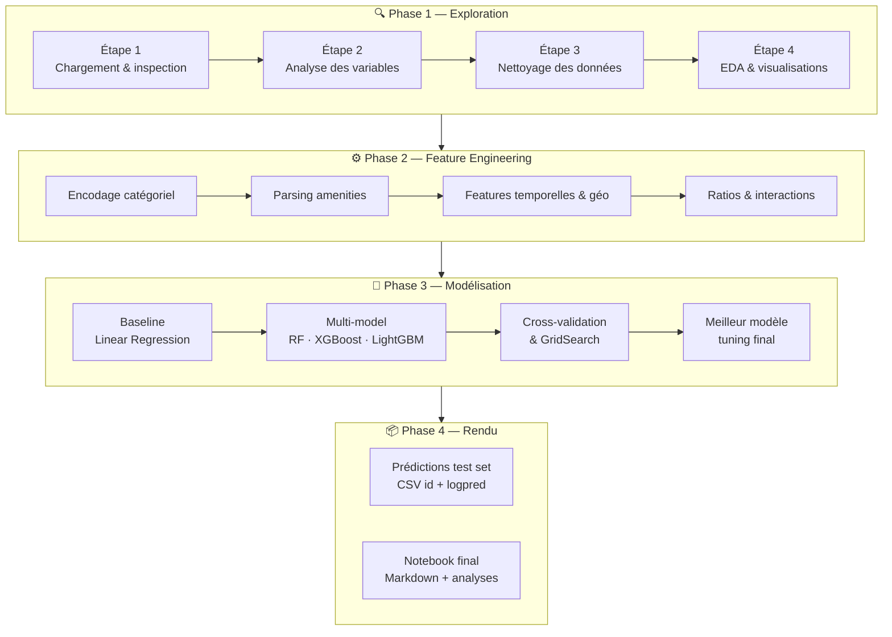

# airbnb-price-oracle
### Eden Elfassy & Léonie Chapelle

Predicting Airbnb listing prices using machine learning. From raw text 
and messy data to a tuned gradient boosting model, with NLP-based amenity 
extraction, geospatial feature engineering, and multi-model benchmarking 
across 22k listings.

## Pipeline


## Résultats

| Modèle | RMSE |
|--------|------|
| Linear Regression (baseline) | 0.4116 |
| Ridge | 0.4136 |
| Lasso | 0.4146 |
| Random Forest | 0.4010 |
| Gradient Boosting | 0.3977 |
| XGBoost | 0.3977 |
| **LightGBM ✅** | **0.3881** |

## Features créées

- **Amenities** : 13 features binaires extraites du champ texte
- **Géographiques** : distance au centre-ville par coordonnées GPS
- **Temporelles** : ancienneté hôte, durée d'activité du listing
- **Ratios** : accommodates_per_bed, beds_per_bedroom
- **Neighbourhood** : target encoding du quartier

## Stack technique
```
Python · Pandas · Scikit-learn · XGBoost · LightGBM · Matplotlib · Seaborn


